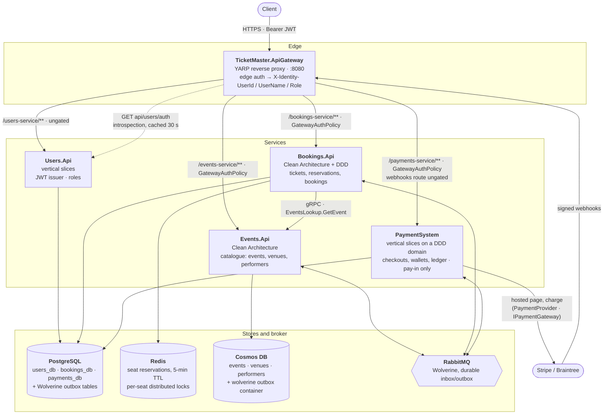
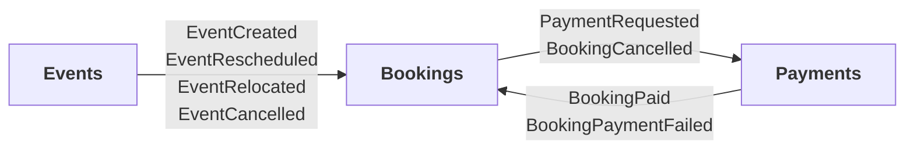
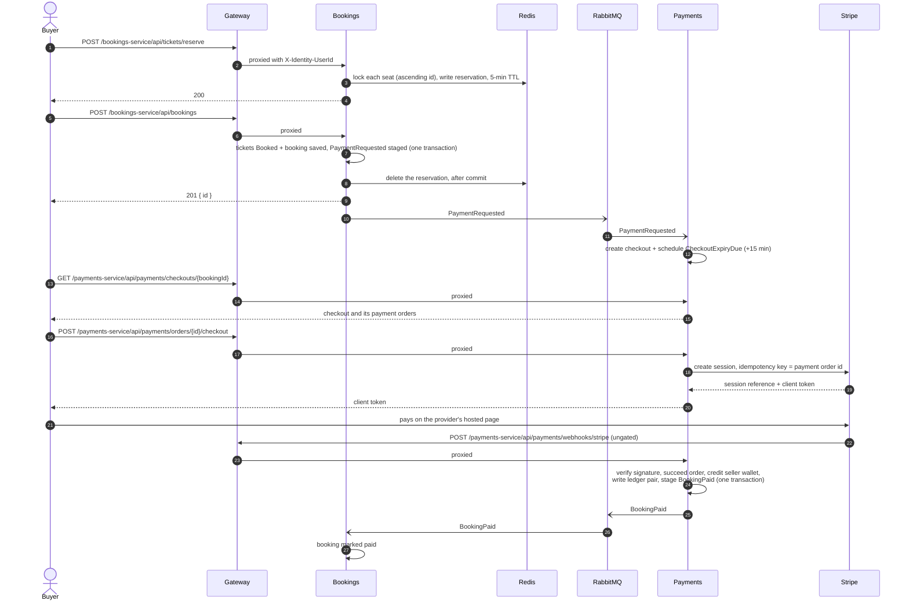

# TicketMaster

A distributed backend for high-concurrency ticket booking, built as a showcase for Clean
Architecture, Domain-Driven Design and event-driven communication on .NET 10.

**Status: 🚧 Active development.** Parts of this are deliberately incomplete, and the gaps are
listed honestly under [Known gaps](#-known-gaps) rather than left for you to discover.

## 🚀 Tech stack

| Concern | Choice |
|---|---|
| Language / runtime | C# 14, .NET 10 (`net10.0`, stable SDK — see `global.json`) |
| Architecture | Clean Architecture + DDD (Bookings, Events), vertical slice (Users), vertical slices on a DDD domain (Payments) |
| CQRS | MediatR — commands, handlers, pipeline behaviors |
| Messaging | WolverineFx over RabbitMQ (Postgres-backed durable inbox/outbox in Bookings and Payments; `WolverineFx.CosmosDb` durable outbox in Events) |
| Relational store | PostgreSQL via EF Core (Bookings, Users, Payments) |
| Document store | Azure Cosmos DB, NoSQL API (Events) |
| Caching / locking | Redis via StackExchange.Redis + Medallion.Threading.Redis |
| Service-to-service | gRPC over HTTP/2 with Protobuf (Bookings → Events), alongside RabbitMQ |
| Edge | YARP reverse proxy with a custom authentication scheme |
| Payment providers | Stripe and Braintree behind `IPaymentGateway` (`PaymentProvider`), hosted payment page + signed webhooks |
| Testing | xUnit + ArchUnitNET, plus Testcontainers (Postgres, Redis, RabbitMQ, Cosmos emulator) for the integration suites |

## 🏗️ Architecture

### System

Every request enters through the gateway. Services own their stores outright: none reads another's
database, and they talk only through RabbitMQ messages and one gRPC call.



### Messages

Every cross-service message is a contract in `TicketMaster.Common/IntegrationEvents`, staged in the
publisher's outbox in the same transaction as the write it announces, and handled idempotently on the other
side.



| Message | From → To | What the consumer does |
|---|---|---|
| `EventCreated` | Events → Bookings | Creates one ticket per seat of the event's venue |
| `EventRescheduled` | Events → Bookings | Moves every ticket's event date; ignored if not newer than the ticket's `EventVersion` |
| `EventRelocated` | Events → Bookings | Reconciles tickets to the seats the event *now* has; a booking that loses a seat is cancelled, or flagged `RefundPending` if paid |
| `EventCancelled` | Events → Bookings | Cancels the event's tickets |
| `PaymentRequested` | Bookings → Payments | Opens a checkout (one payment order per seller) and schedules its 15-minute expiry |
| `BookingCancelled` | Bookings → Payments | Fails the checkout's unsettled orders; a paid one is left and logged for refund |
| `BookingPaid` | Payments → Bookings | Confirms the booking |
| `BookingPaymentFailed` | Payments → Bookings | Cancels the unpaid booking and releases its seats |

### A booking, end to end



If nobody pays, the expiry fails the checkout after 15 minutes and `BookingPaymentFailed` releases the
seats. A cancelled booking sends `BookingCancelled` the other way.

The gateway requires an authenticated caller on `/bookings-service/**`, `/events-service/**` and
`/payments-service/**` (except PSP webhooks), checked by calling Users.Api's `GET api/users/auth`;
`/users-service/**` is not gated. It forwards the resolved identity downstream as `X-Identity-UserId` /
`X-Identity-UserName` / `X-Identity-Role` headers — Bookings and PaymentSystem read identity from those
rather than re-validating the token; Events does not use identity at all. Two actions are admin-gated:
`POST /api/tickets`, which Bookings refuses (403) unless the role header says `Admin`, and
`PUT /api/users/{id}/role`, which Users.Api checks against the JWT's role claim.

Bookings also calls Events synchronously over gRPC (`EventsLookup.GetEvent`, contract in
`TicketMaster.Common/Protos/events.proto`) to validate an event when a ticket is created.

Events owns the catalogue and never learns about bookings; Bookings reacts to the catalogue and never
writes to it. Every ticket that exists does so because Events said an event exists, and every ticket
that changes does so because Events said the event changed.

## 🌐 API surface

Paths below are as each service serves them; through the gateway, prefix them with `/users-service`,
`/events-service`, `/bookings-service` or `/payments-service` (e.g. `POST /bookings-service/api/bookings`).

Users handles accounts and tokens (ungated at the gateway):

```
POST   /api/users/registration          # the first account ever registered becomes Admin
POST   /api/users/login
POST   /api/users/refreshToken
GET    /api/users/auth                  # the gateway's introspection call; requires a JWT
PUT    /api/users/{id}/role             # admin only; 204
```

Venues and performers each expose a conventional CRUD surface:

```
GET    /api/venues            GET    /api/performers        # cursor-paged
GET    /api/venues/{id}       GET    /api/performers/{id}
POST   /api/venues            POST   /api/performers        # 201 + { id }
PUT    /api/venues/{id}       PUT    /api/performers/{id}
DELETE /api/venues/{id}       DELETE /api/performers/{id}   # 409 if in use
```

Events deliberately differ:

```
GET    /api/events                    # cursor-paged
GET    /api/events/{id}
POST   /api/events                    # 201 + { id }
PUT    /api/events/{id}/schedule      # reschedule
PUT    /api/events/{id}/venue         # relocate — reconciles tickets downstream
PUT    /api/events/{id}/lineup        # change performers
POST   /api/events/{id}/cancel        # idempotent; no DELETE exists
```

Bookings exposes the checkout; every action except the admin `POST /api/tickets` is scoped to the caller
the gateway resolved:

```
POST   /api/tickets                     # admin only (403 otherwise); one seat, validated against Events over gRPC
POST   /api/tickets/reserve             # hold seats for 5 minutes
POST   /api/bookings                    # 201 + { id }
GET    /api/bookings/{id}               # the caller's own; somebody else's is a 404
                                        # responses carry createdAt
GET    /api/bookings?page=&pageSize=    # the caller's own, newest first
POST   /api/bookings/{id}/cancel        # 204; a paid booking is refused with 400
```

Payments exposes the checkout's payment side, also scoped to the caller; PSP webhooks are the one
route the gateway leaves ungated, because the provider signs them instead:

```
POST   /api/payments/orders/{id}/checkout        # start the PSP session → client token for the hosted page
POST   /api/payments/orders/{id}/payment-method  # synchronous charge (Braintree); 202 when the outcome comes by webhook
POST   /api/payments/webhooks/{provider}         # PSP callback — signature-verified, no user token
GET    /api/payments/checkouts/{bookingId}       # the buyer's checkout and its orders
GET    /api/payments/orders/{id}                 # visible to the order's buyer or its seller
GET    /api/payments/orders/{id}/ledger          # the order's debit/credit pair (sums to zero)
GET    /api/wallets/me                           # the caller's wallets, one per currency
```

No request body carries a user id. Identity comes from the gateway's `X-Identity-UserId` header, and
every Bookings and Payments action that acts for a user answers 401 without it, so a caller cannot book as somebody else by editing the body. A
booking belonging to another user answers exactly as a nonexistent one does — telling them apart
would confirm the id exists to someone with no business knowing.

Each event mutation has a different downstream consequence — relocating changes which seats exist,
rescheduling does not — so they are separate sub-resources rather than one `PUT` that would have to
infer intent by diffing. And an event is cancelled rather than deleted: tickets exist downstream, so
removal is a state transition. Catalogue collection reads (events, venues, performers) take `pageSize`
and return a `continuationToken`; send it back to page, and a null token means there is nothing more.
Cosmos charges for rows an `OFFSET` skips, which is why those have no page number. Bookings, on Postgres,
pages by `page`/`pageSize` and returns `items`, `page`, `pageSize`, `total` and `hasMore`.

## 📦 Services

| Service | Layout | Store | Responsibility |
|---|---|---|---|
| **Users.Api** | Vertical slice (`Features/Users/…`) | Postgres | Registration (the first account becomes Admin), authentication, refresh tokens, admin role assignment. Issues the JWTs and answers the gateway's introspection call. |
| **Bookings** | `Domain` / `Application` / `Sql` / `Api` | Postgres + Redis | Reservations and bookings. Owns the whole ticket lifecycle — held in Redis, sold in Postgres, settled or released when a payment result arrives — with a distributed lock per seat guarding concurrent reservation. |
| **Events** | `Domain` / `Application` / `Cosmos` / `Api` | Cosmos DB | The catalogue: venues and performers with full CRUD; events created, rescheduled, relocated, re-lined-up and cancelled (never deleted). Serves the `EventsLookup` gRPC service Bookings calls. Publishes `EventCreated`, `EventRescheduled`, `EventRelocated` and `EventCancelled` — the first is what causes tickets to exist in Bookings, and the rest are what keep them correct. |
| **PaymentSystem** | Vertical slices (`Features/<Aggregate>/<Feature>.cs`) on a DDD `Domain/` | Postgres | The pay-in flow: a checkout per booking with one payment order per seller, PSP checkout and webhooks, seller wallets, a double-entry ledger, 15-minute checkout expiry. Publishes `BookingPaid` / `BookingPaymentFailed`. |
| **PaymentProvider** | Class library | — | Anti-corruption layer over the PSPs (Stripe, Braintree) behind `IPaymentGateway`. |
| **TicketMaster.ApiGateway** | — | — | YARP routing, edge authentication, identity header propagation. |
| **TicketMaster.Common** | — | — | Integration event contracts and the `events.proto` gRPC contract shared across service boundaries. |

## 🔑 Patterns worth looking at

**CQRS with MediatR.** Commands in `*.Application/Commands` (one exception: Bookings'
`CancelBookingCommand` sits in `Queries/CustomerBookingQueries.cs`, beside the queries it is used with),
handlers in `CommandHandlers`, with open-generic `IPipelineBehavior<,>` for cross-cutting concerns.
PaymentSystem keeps each command, query and handler together in its feature file instead.

**Two things hold a seat, at different stages (Bookings).** Reserving writes a Redis key with a TTL
and nothing else, so a checkout abandoned before booking lapses on its own and needs no compensating
action. Booking replaces that with a durable hold: the reservation is deleted and the ticket's own
status carries it. The trade is explicit — after booking, the TTL no longer applies to those seats, so
only a cancellation of the booking can put them back: a `BookingPaymentFailed`, the owner cancelling, or a
relocation that removes one of its seats. The unpaid case has a timeout, and it lives in PaymentSystem: a
checkout nobody pays for fails after 15 minutes.

**Reservation checks the database before holding anything.** `Ticket.IsAvailableFor` is the rule —
nobody holds the seat, it belongs to the event being asked about, and that event is inside its selling
window — so a ticket that does not exist, is already sold, or was cancelled with its event is refused
at the reservation step rather than accepted and rejected later. Booking re-checks by calling the same
method on tickets read by id, so the rule has one evaluator and no database-side copy to keep in step
(reservation checks event membership separately first, only to return a more specific error).

**A lock per seat, taken in a fixed order (Bookings).** Reservation locks
`bookings:reserve:ticket:{id}` rather than one shared key, so reservations for different seats run
concurrently instead of queuing behind each other. Multiple locks are always acquired in ascending
ticket id order, which is what makes overlapping requests deadlock-free: both take seat 7 before seat
9, so neither ends up holding what the other waits for. Duplicate ids are rejected rather than
deduplicated, because the locks are not reentrant.

**Transactional pipeline, scoped to writes (Bookings).** `Bookings.Sql/Pipelines/TransactionBehavior`
is constrained to `ITransactionalRequest`, so it wraps only requests that touch the database — the
registration is open-generic, and without the constraint a Redis-only reservation opened a Postgres
transaction that rolled nothing back. It also stands aside when Wolverine's EF Core middleware already
holds a transaction on the context, which happens on every message-driven path: a second transaction
on that connection is not possible, and committing Wolverine's early would break the outbox guarantee
it exists for.

**After-commit work (Bookings).** Redis does not roll back with a database transaction, so work aimed
at it is queued on `IAfterCommitQueue` and run by `TransactionBehavior` once its own transaction has
committed — on the deferred path it cannot observe the commit, so it logs the work as dropped rather
than guessing. Booking deletes its reservation that way — if the booking then fails, the user still holds the reservation and can retry.
A failure in that cleanup is logged rather than thrown: the commit already happened, so failing the
request would invite a retry of work that is done.

**Payment settled by whichever outcome lands first.** `Booking.Cancel()` refuses a paid booking and
`Booking.MarkPaid()` refuses a cancelled one, so the two contracts need no version to survive
unordered, at-least-once delivery — a late failure cannot void a paid booking, and a late success
cannot claim seats already back on sale. Applying the same outcome twice announces the release once,
so seats are never released a second time after somebody else has taken them.

**Domain event dispatch, two ways.** Bookings (and Payments) use a `SaveChangesInterceptor`, so persistence and
event emission cannot diverge. Dispatch runs *after* the write, so a handler that changes something
must save that change itself — the surrounding transaction is what keeps its save atomic with the
write that triggered it. Events are cleared before publishing rather than after: a handler that saves
re-enters the interceptor while the aggregate is still tracked, and one still holding its events would
publish them again and re-run that handler, which is recursion rather than a duplicate delivery. Events has no such hook available — Cosmos offers no equivalent — so
dispatch is explicit in the command handler, ordered load → mutate → write → stage-to-outbox. The ordering is
load-bearing in both directions: a refused mutation throws before the write, so nothing is stored
*and* nothing is announced; staging into the outbox after the write means no consumer hears about a change that
failed to persist.

**Domain events are translated, never published raw (Events).** The aggregate raises a private
`IDomainEvent`; `Events.Application/IntegrationEvents` maps it to a public contract in
`TicketMaster.Common` and stages it through a single `IIntegrationEventPublisher`. `Events.Domain`
therefore never learns the shared contracts exist. A domain event is allowed to have no public
counterpart — a lineup change has none, because nothing outside depends on who is performing.

**A durable outbox on Cosmos, via the maintained package (Events).** `WolverineFx.CosmosDb`
(`UseCosmosDbPersistence`) gives Events a durable outbox: `OutboxIntegrationEventPublisher` translates
the aggregate's domain events and hands them to an `IIntegrationEventDispatcher`, which
`CosmosOutboxDispatcher` implements by staging them through Wolverine's `CosmosDbOutbox` and flushing,
so envelopes persist and a relay resends them after a crash. The trade is honest: Wolverine keeps its
envelopes in a separate `wolverine` container (per-item upsert, no cross-container batch), so a message
is durable but **not atomic** with the `events` write — a small crash window remains. A hand-rolled
in-document outbox would be strictly atomic but bespoke; the team chose the standard package. Bookings'
version guard makes redelivery harmless, so at-least-once from the outbox is enough.

**Messages carry resulting state, and a version (Events → Bookings).** `EventRelocated` says which
seats the event *now* has, not which were added or removed, so applying it twice lands in the same
place. Each message also carries the aggregate's `Version`; `Ticket.EventVersion` records how far
each ticket has got and rejects anything not newer, so a redelivered older relocation cannot revert a
newer one. Reconciling a relocation can create tickets, so that handler additionally rejects stale
messages as a whole — a seat that does not exist yet has no version to compare against.

**Transactional outbox storage (Bookings).** `PersistMessagesWithPostgresql` plus
`UseEntityFrameworkCoreTransactions` puts the message store alongside the state it describes, and all
three durability policies are applied, so the broker endpoints are enrolled rather than just the
in-process queues. The host-boot fixture asserts every broker listener and sender comes up in
`EndpointMode.Durable`, so the enrolment is observed rather than assumed.

**Persistence-ignorant domain (Events).** `Events.Domain` has *zero* package and project
references — no driver types, no DI abstractions — enforced by architecture tests. Entity ids are
strings; all Cosmos knowledge lives in `Events.Cosmos`.

**Cosmos modelling (Events).** Three domain containers (`events`, `venues`, `performers`) sharing one
400 RU/s database-level allocation, alongside the `wolverine` envelope container the outbox adds to the same
database. Each is partitioned by `/id`, so reads by id are point reads, the cheapest operation Cosmos offers. Events embed a *snapshot* of their
venue and performers: renaming a venue deliberately does not rewrite history. Documents are
serialized through a private rehydration constructor, so loading a past event never re-runs the
creation invariants that would reject it.

**One aggregate per checkout, one order per seller (Payments).** `PaymentEvent` is the root and the only
way to change its `PaymentOrder`s, so the checkout-wide rule — done once every order has succeeded — cannot
be bypassed. Repeating an outcome is a no-op and the opposite outcome is refused, which is what makes
redelivered webhooks and messages safe. The domain refuses any amount `numeric(18,2)` cannot hold exactly,
because Postgres would otherwise round it and the PSP would charge a different amount than the ledger
records.

**A version the database checks, set at save time (Payments).** Two orders of one checkout settling at
once would each see the other unfinished; `PaymentEvent.Version` makes the second save fail and reload. An
interceptor sets it from the version the checkout was *loaded* with — a domain-side bump let a stale
disconnected copy overwrite a newer row.

**An outbox on the HTTP path, not only on messages (Bookings, Payments).** Both services publish through
an `IIntegrationEventPublisher` that stages into Wolverine's `DbContextOutbox` on the transaction already
open and sends after commit, so a webhook's settlement, its ledger pair and its `BookingPaid` commit or roll
back together. Wolverine's own `SaveChangesAndFlushMessagesAsync` is avoided because it commits the
transaction itself.

## 🧪 Testing

Test projects are grouped by service so a module can be lifted out whole when it becomes an
independently deployable microservice:

```
Tests/
├── Bookings/   BookingArchitecture, BookingDomain, BookingIntegration, BookingApi
├── Events/     EventsArchitecture, EventsDomain, EventsApplication, EventsCosmos, EventsApi, EventsIntegration
├── Gateway/    GatewayTests
├── Payments/   PaymentArchitecture, PaymentDomain, PaymentIntegration, PaymentAdapters
├── Rpc/        GrpcSeam
└── Users/      UsersArchitecture, UsersApi, UsersIntegration
```

**Architecture tests** (ArchUnitNET) assert layer dependencies, naming, visibility and — in Bookings and
Payments — layout; the Users suite checks handler/request colocation.
The Events suite additionally forbids any database driver, `System.Drawing`, or DI abstraction from
appearing in `Events.Domain` — the rules that keep the store swappable.

**Unit tests** cover the domain rules of both aggregates and Cosmos document serialization, plus the
Events application handlers against in-memory fake repositories. The serialization tests exercise the
same `JsonSerializerOptions` the `CosmosClient` is built with, so they verify the real document shape
without needing an emulator.

**Integration tests** (`Tests/Bookings/BookingIntegration`) run the real `BookingDomainContext`,
domain event interceptor, transaction behavior and every Bookings command/query handler against real
Postgres and Redis in Testcontainers — one container of each, shared across the project by a single
fixture. They exist for questions a fake cannot answer, and each one settles a claim the design
depends on rather than restating a unit test:

- Redis lock ordering, contention and TTL expiry behave the way the handlers assume
- EF Core tolerates the nested `SaveChangesAsync` that domain event dispatch performs, and clearing
  events before publishing is what stops it recurring
- a second transaction on one context really does throw — which is why the behavior defers instead
- dependency injection genuinely *skips* an open-generic pipeline behavior whose generic constraint
  the request does not satisfy, rather than failing to build it
- after-commit work runs only once the transaction has gone, and not at all when it rolls back

A second fixture in the same project boots the **real host** — `Program.cs` unmodified, Wolverine and
RabbitMQ included — through `WebApplicationFactory<Program>` against its own Postgres, Redis and
RabbitMQ containers. It exists because a whole class of failure here is invisible to everything else:
a durability policy that was never applied, a handler dependency Wolverine cannot resolve, a
code-generation mode with no compiler behind it. All of them compile, and all of them leave every
other suite green. It is what proves the broker endpoints are actually enrolled in the durable inbox.

The two fixtures own separate containers and run in parallel; the fast one never starts a broker,
which is what keeps the rest of the suite at about a second.

Events has its own container-backed suite, `Tests/Events/EventsIntegration`, running the real
repositories, pipeline behaviors and handlers against the **Cosmos emulator** in Testcontainers. It
settles what unit tests and the serialization suite could not reach: the `_etag`/412 conditional-write
path surfacing as `ConcurrencyConflictException`, the cross-partition delete guards actually refusing a
delete, and the aggregate documents round-tripping through the real SDK. It pins
`azure-cosmos-emulator:vnext-latest` — the only line with a native arm64 build — and talks to it in
Gateway mode over cleartext http, because that emulator rejects the SDK's default Direct mode. A single
`CosmosOptions.ConnectionMode` config seam (unset, hence Direct, in every real deployment) is the only
production concession. A second collection in the same project boots the **real Events host** — Wolverine
and the Cosmos outbox included — on the emulator plus a **RabbitMQ** container, and proves the outbox
relay end to end: a create-event command's `EventCreatedIntegrationEvent` reaches a second Wolverine
consumer host. It mirrors Bookings' host fixture. See the `testing` skill for the fixtures, the
two-scope 412 trick and the limits.

Payments has `Tests/Payments/PaymentIntegration`: every slice through the production
`AddInfrastructureServices` against real Postgres, with the schema built by the real migrations, plus
concurrency, integrity, precision, timestamp and domain-event suites, and a `Mechanics/` collection that boots
the real host on Postgres and RabbitMQ with a stand-in Bookings host (request → checkout, cancel, expiry,
outbox rollback). `PaymentDomain` covers every aggregate rule, `PaymentAdapters` the PSP adapters, and
`PaymentArchitecture` the slice rules — the domain depends on nothing but itself, `PaymentSystem.Enums`, the BCL and MediatR, no feature area
reaches into another, `PaymentProvider` never references `PaymentSystem`, handlers are internal and sealed,
and every writing command is transactional.

**Needs a running Docker daemon** — every test in `BookingIntegration`, `EventsIntegration` and `PaymentIntegration` starts
containers; with the daemon down the whole project fails at fixture initialisation. `Bookings.Sql` and
`Bookings.Application` carry `InternalsVisibleTo("BookingIntegration")` so the tests can construct the
internal context, repositories and handlers; `Bookings.Application` and `Events.Api` also expose internals
to `GrpcSeam`, and `PaymentSystem` to `PaymentIntegration`. `EventsIntegration` needs no such entry — it
reaches everything through public interfaces (`ISender`, the repository contracts).

Users.Api has `Tests/Users/UsersIntegration`: the real host on a Postgres container, driving registration,
login and `PUT /api/users/{id}/role` over HTTP with tokens from the real endpoints. It covers the
first-account-becomes-Admin bootstrap (including the race between two first registrations) and the admin-only
role change. It is what found that every register, login and refresh had been answering 500 — the handlers'
`IOptions<AuthOptions>` could not be constructed from a positional record — and that a numeric or
comma-joined role string was accepted.

`Tests/Gateway/GatewayTests` boots the real gateway in-process through `WebApplicationFactory<Program>`,
stubbing only the Users introspection client and YARP's forwarder, and covers edge auth, identity-header
propagation, the payments routes (including the ungated webhook route) and config invariants.
`Tests/Rpc/GrpcSeam` runs an in-process gRPC round trip — the real `EventsLookupService` and
`DomainExceptionInterceptor` against the real Bookings `EventsService` client over a TestServer — to prove
domain errors survive the seam. Neither needs Docker.

Handlers are `internal` by architecture rule, so each test project that constructs them relies on an
`InternalsVisibleTo` entry in the production `.csproj`.

```bash
dotnet test Tests/Events/EventsDomain/EventsDomain.csproj
dotnet test Tests/Events/EventsApplication/EventsApplication.csproj
dotnet test Tests/Events/EventsApi/EventsApi.csproj
dotnet test Tests/Events/EventsCosmos/EventsCosmos.csproj
dotnet test Tests/Events/EventsArchitecture/EventsArchitecture.csproj
dotnet test Tests/Events/EventsIntegration/EventsIntegration.csproj   # Cosmos emulator; needs Docker
dotnet test Tests/Bookings/BookingDomain/BookingDomain.csproj
dotnet test Tests/Bookings/BookingIntegration/BookingIntegration.csproj
dotnet test Tests/Bookings/BookingApi/BookingApi.csproj
dotnet test Tests/Bookings/BookingArchitecture/BookingArchitecture.csproj
dotnet test Tests/Users/UsersArchitecture/UsersArchitecture.csproj
dotnet test Tests/Users/UsersApi/UsersApi.csproj
dotnet test Tests/Users/UsersIntegration/UsersIntegration.csproj   # needs Docker
dotnet test Tests/Payments/PaymentArchitecture/PaymentArchitecture.csproj
dotnet test Tests/Payments/PaymentDomain/PaymentDomain.csproj
dotnet test Tests/Payments/PaymentIntegration/PaymentIntegration.csproj   # needs Docker
dotnet test Tests/Payments/PaymentAdapters/PaymentAdapters.csproj
dotnet test Tests/Gateway/GatewayTests/GatewayTests.csproj
dotnet test Tests/Rpc/GrpcSeam/GrpcSeam.csproj
```

**Not covered, deliberately:** most Wolverine `Consume` handlers are two-line delegations to commands
that are already covered directly, so only a representative few are driven off a real broker by the host
fixtures — Bookings' `BookingPaymentFailed`, and Payments' `PaymentRequested` (including a redelivery) and
`BookingCancelled` — alongside assertions that every broker endpoint is durable. Version-based staleness
guards under genuine out-of-order delivery remain untested by design. See the `testing` skill's "Not
covered, deliberately" for the rest of that list.

**The suite is green on a clean checkout**, architecture tests included, so a red test means
something actually broke rather than something known. `Bookings.Application` is organised by type then
area — a request under `Commands/` or `Queries/`, its handler under `CommandHandlers/<Area>/` or
`QueryHandlers/<Area>/` — so a handler is never in its command's namespace. `LayoutTest` asserts that a
handler sits under the root its own suffix claims, which is what stops a query handler drifting in
among the command handlers.

## ▶️ Running locally

The whole system, in containers — use the gateway at `http://localhost:8080` as the entry point (each
service and backing store is also published on the host for debugging: users 5054, events 5158/5159,
bookings 5225, payments 5290):

```bash
cp .env.example .env      # then set USERS_AUTH_TOKEN (e.g. openssl rand -hex 64) and the two
                          # PAYMENTS_STRIPE_* test-mode keys — PaymentSystem refuses to start without them
docker compose up --build
```

The first account you register becomes the admin; everyone after is a customer. Compose runs the
`vnext-latest` Cosmos emulator, which has a native arm64 build, so this works on Apple Silicon too.

Or run the services directly:

```bash
dotnet restore TicketMaster.slnx
dotnet build TicketMaster.slnx

dotnet run --project Users.Api/Users.Api.csproj --launch-profile https          # https://localhost:7054
dotnet run --project Bookings.Api/Bookings.Api.csproj --launch-profile https    # https://localhost:7225
dotnet run --project Events.Api/Events.Api.csproj --launch-profile https        # https://localhost:7158 (gRPC needs HTTP/2)
dotnet run --project PaymentSystem/PaymentSystem.csproj                         # https://localhost:7291
dotnet run --project TicketMaster.ApiGateway/TicketMaster.ApiGateway.csproj     # http://localhost:5203

The `https` profiles matter: the gateway's clusters and Bookings' gRPC client point at those ports, while a
plain `dotnet run` picks each service's first (`http`) profile.
```

PaymentSystem validates its PSP settings at startup, so it does not boot with the empty secrets in
`appsettings.json`:

```bash
dotnet user-secrets set "PaymentProviders:Stripe:SecretKey" "sk_test_…" --project PaymentSystem
dotnet user-secrets set "PaymentProviders:Stripe:WebhookSecret" "whsec_…" --project PaymentSystem
```

Bookings, Users and PaymentSystem apply EF Core migrations at startup; Events creates its Cosmos database and
containers at startup. The JWT signing key is empty in `appsettings.json`, so outside Development (in
compose, for instance) Users.Api fails fast until `AuthConfigs__Token` is set. `appsettings.Development.json`
currently carries a development key; override it with user-secrets:

```bash
dotnet user-secrets set "AuthConfigs:Token" "$(openssl rand -hex 64)" --project Users.Api
```

Events expects the Cosmos emulator on `http://localhost:8081`, in Gateway mode — both set in
`appsettings.Development.json`, along with the emulator's well-known account key, which is not a secret.
The vnext emulator serves plain http, so there is no certificate to trust. Bring up just the backing stores with
`POSTGRES_PASSWORD=password docker compose up postgres redis rabbitmq cosmos` — the checked-in connection
strings use the password `password`.

Central package management is enabled: add package versions to `Directory.Packages.props`, never
`Version="…"` on an individual `<PackageReference>`.

## 🗺️ Known gaps

Split two ways: not built, and deliberate. Every entry names what the code does today rather than what
it should do — the fix is a decision, not a gap.

### Not built

- **Ticket prices are placeholders.** Neither Events nor Bookings has a price or a seller, so Bookings
  sends `$50 × tickets` in USD and a seller derived from the event id (`PaymentPricing`). Payments treats the
  request's amount as authoritative, so it is correct the moment real pricing exists upstream.
- **No refunds.** Payments is pay-in only. A booking cancelled after its payment succeeded is logged as
  needing a refund, and a `RefundPending` booking in Bookings is still never refunded.
- **No reconciliation job** against PSP settlement files, so a charge the service failed to record stays
  `Executing` until someone looks.
- **A role change takes effect at the next login.** `AdminOnly` reads the role claim baked into the token,
  never the store, so a demoted admin keeps admin access until their token expires (1 day) and a promoted
  user must log in again. Nothing stops an admin demoting the last admin, themselves included.

### Accepted limitations

Deliberate, and recorded so nobody "fixes" one without knowing what it carries.

- **The gateway trusts an introspection for 30 seconds.** A successful check is cached by a hash of the
  token (`IntrospectionCache`), so a token revoked or a role changed in Users.Api keeps working at the edge
  for up to that long. Refusals and outages are never cached.
- **Two first registrations at once both become Admin.** The empty-table check and the insert are separate
  statements with no guard between them — acceptable for a one-time bootstrap, and pinned by a test that
  will turn red if a guard is ever added.
- **The Events outbox is durable but not atomic.** `WolverineFx.CosmosDb` stores envelopes in a
  separate `wolverine` container by per-item upsert, so the message survives a crash but is not written
  in the same batch as the `events` document — a small window where the write lands and the envelope
  does not, or vice versa. A hand-rolled in-document outbox would close it but is bespoke; the standard
  package was chosen deliberately, and Bookings' version guard makes the resulting at-least-once,
  possibly-lost-once delivery tolerable.
- **`Events.Application.Pipelines.TransactionBehavior` is a no-op** — its body is `return next(...)`.
  Under Cosmos there is no honest implementation: atomicity is confined to a single logical partition,
  and with `/id` partition keys no two documents ever share one.
- **The venue and performer delete guards are best-effort.** Each counts upcoming events and refuses the
  delete, but an event can be created in that window and no transaction spans two logical partitions.
  Events are cancelled rather than deleted, so they need no equivalent guard.
- **Reservation correctness rests entirely on the distributed locks.** The check and the write both
  happen with every seat's lock held, but the write is not conditional, so a lock lost mid-operation is
  a real double-reservation window rather than a wasted attempt.
- **A cancellation that reaches Payments before its `PaymentRequested`** is a no-op; the checkout is then
  created, and only the 15-minute expiry fails it — a buyer who pays inside that window pays for a cancelled
  booking.
- **After-commit work is dropped when a command is sent from a message handler.** `TransactionBehavior`
  does not own that transaction, so it logs a warning rather than running the queued work — the same way
  a failure on the owned path is treated. Only `MakeBookingCommand` queues any, and only over HTTP, so
  nothing hits this today.

## 🗺️ Roadmap

- Real ticket pricing and sellers in Events, replacing Bookings' `PaymentPricing` placeholder
- Refunds and notifications — for a `RefundPending` booking and for a booking cancelled after payment
- Reconciliation against PSP settlement files, using `IPaymentGateway.LookupAsync`
- Saga / process-manager work for the full booking flow in Wolverine
